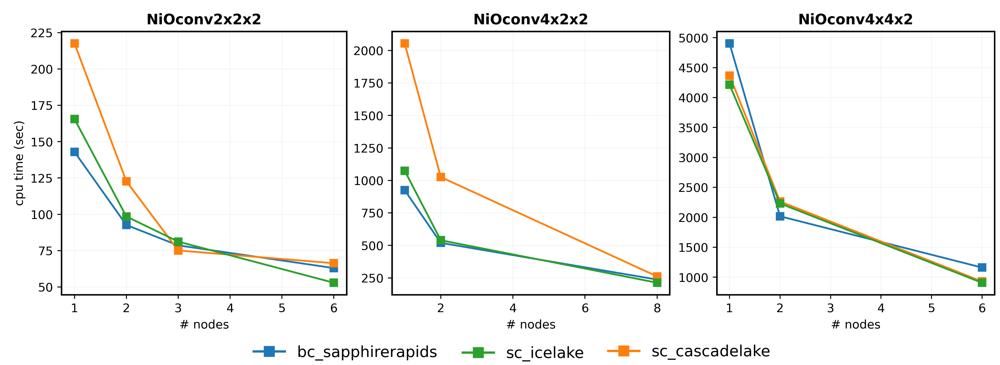
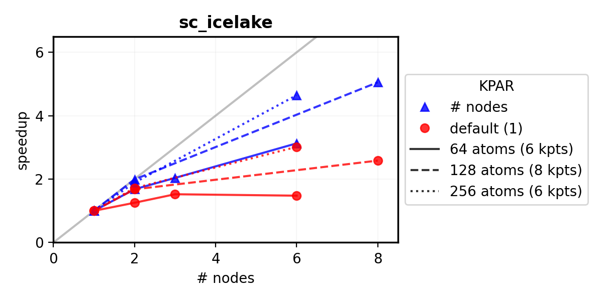

# psu-roarcollab

Information about the Penn State Roar Collab HPC. Useful for tracking Sinnott group and MRSEC IRG2 allocation balances, available hardware, and VASP scaling performance.

## Allocation Balances
Tracking began on December 12, 2023

## Available Hardware
|cpu codename       |memory type|cores/node |memory/node (gb)   |memory/core (gb)   |partitions             |
|:---               |:---       |:---       |:---               |:---               |:---                   |
|*sapphirerapids*   |basic      |64         |255                |3.98               |open, sla-prio, burst  |
|*icelake*          |standard   |48         |500                |10.42              |open, sla-prio, burst  |
|*cascadelake*      |standard   |48         |350                |7.29               |open, sla-prio, burst  |

The `IceLake` standard cores should be used preferably over the `CascadeLake` in most cases for VASP calculations, as the NiO scaling calculations were almost always less time when using the `IceLake` standard cores:

Some research on the different Intel codenames would indicate that the `IceLake` series is newer than `CascadeLake`, so these findings make sense. The `IceLake` hardware can be called using `--constraint = icelake` in the slurm submission script.

## VASP General Scaling Rules
1. Use all of the cores/node available unless running relatively 'small' calculations (< ~20 atoms)
2. A single node should be used in most routine cases, and *never* use more nodes than kpoints
3. KPAR should be the number of nodes (and a factor of kpoints)
4. NCORE performance is general best for `NCORE = 16` and can be used for all hardware types

## VASP Scaling Results
Using the *speedup* as defined in https://hpc-wiki.info/hpc/Scaling that can be used as a quantitative analysis of how well VASP calculations scale and is defined as:

$$Speedup = \frac{t(1)}{t(N)}$$

where $t(1)$ is the computational time for running the software using one core, and $t(N)$ is the computational time running the same software with N cores. Only `SapphireRapids` and `IceLake` hardware is shown for basic and standard cores, respectively, given the above results for `IceLake` hardware. A grey line is added for 'linear scaling', which would be the ideal case where we use all of our resources as efficiently as we can, however this is rarely ever met.

The basic cores with >1 node and the default `KPAR = 1` scale quite horribly, where using more nodes actually results in a longer time than just using a single node. This can be seen by the speedup value less than 1. Use of a properly tuned `KPAR` value is especially important for multi-node jobs with basic cores.

The standard cores with >1 node and the default `KPAR = 1` scale better, however there is still much to gain by tuning the `KPAR` for a given calculation, especially considering there is minimal effort involved from the human side.
